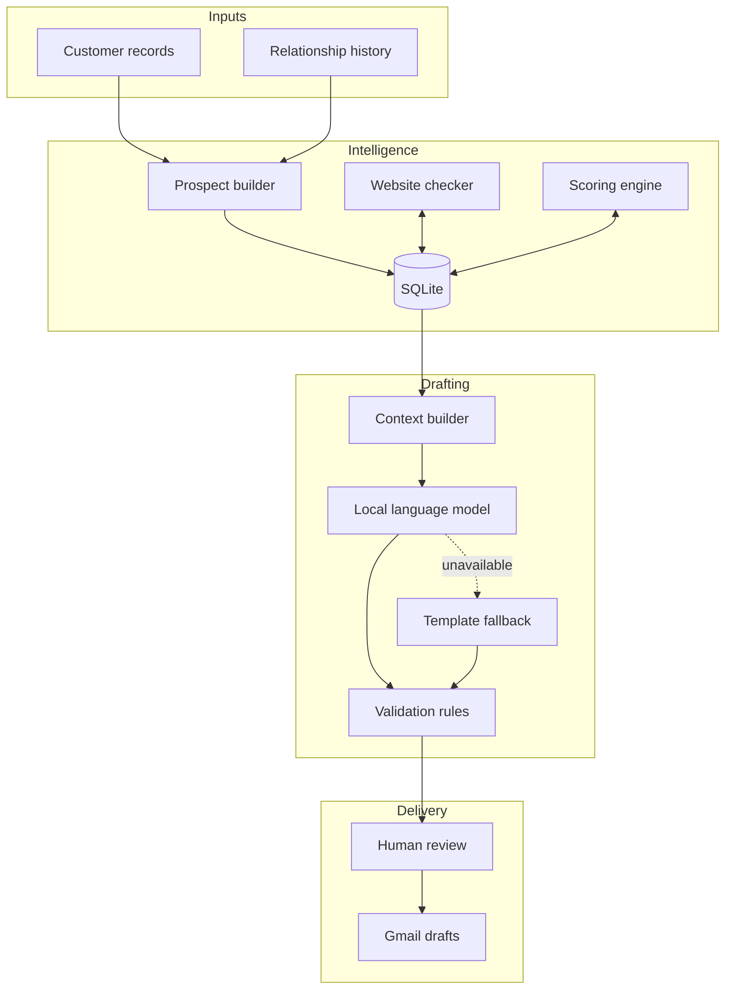

# Outreach Intelligence OS

**An AI-assisted operations system that turns historical customer relationships into prioritized, review-ready outreach.**

`Python` · `SQLite` · `Local AI` · `Gmail API` · `Workflow Automation`

## At a glance

| | |
|---|---|
| **Business problem** | Valuable customer history was difficult to qualify and reactivate consistently |
| **Primary user** | Growth operator reviewing and preparing outreach |
| **Scale** | 4,000+ qualified prospect records |
| **AI role** | Draft generation and context-aware personalization |
| **Control model** | Explainable ranking, validation, human approval, draft-only delivery |

## The problem

Historical customer conversations contain useful relationship and business
signals, but reviewing them manually does not scale. A contact list alone also
does not explain who should be contacted, why they matter, or what message would
be appropriate.

I designed Outreach Intelligence OS to turn that unstructured history into a
controlled operating workflow—from qualification through human-approved email
drafting.

## How it works

## Core capabilities

- Builds a structured prospect pipeline from existing customer relationships
- Searches and filters by business context, industry, priority and website state
- Uses configurable multi-factor scoring rather than opaque AI ranking
- Explains the evidence behind each prospect's priority
- Checks website availability before outreach preparation
- Generates restrained, context-aware email drafts using a local language model
- Rejects unsupported claims, invented figures, hype and invalid references
- Falls back to deterministic templates when AI output is unavailable or invalid
- Supports human editing and approval
- Creates Gmail drafts individually or through a controlled batch workflow
- Never sends email automatically

## AI implementation

The language model is used only where probabilistic generation is useful:
turning approved prospect context into a concise outreach draft. Deterministic
software remains responsible for eligibility, ranking, validation, workflow
state and delivery controls.

This separation keeps the system useful when the model is unavailable and makes
AI output reviewable before it reaches Gmail.

## Technology stack

| Layer | Technology |
|---|---|
| Backend | Python |
| Data | SQLite with indexed operational fields |
| Interface | HTML, CSS and vanilla JavaScript |
| AI | Locally hosted model through an OpenAI-compatible endpoint |
| Email | Gmail API using compose permissions |
| Background operations | Threaded website checks and bounded batch drafting |
| Runtime | Local, single-operator application |

## Key design decisions

1. **Explainable priority:** operators can see why a prospect was ranked.
2. **AI writes; rules decide:** generated copy must pass deterministic checks.
3. **Graceful fallback:** drafting continues without depending entirely on a model.
4. **Human approval:** operators retain control over edits and final selection.
5. **Draft-only integration:** the system prepares Gmail drafts but cannot send automatically.

## My contribution

I identified the operational opportunity, designed the end-to-end workflow,
defined the prioritization and safety model, and directed the AI-assisted
implementation and iteration of the system.

My work centered on translating a business problem into a practical operating
system: deciding what data mattered, how users should move through the workflow,
where AI added value, and where deterministic controls were required.

## Further documentation

- [Architecture](docs/architecture.md)
- [Capabilities](docs/capabilities.md)
- [Design decisions](docs/design-decisions.md)
- [Evidence and claim boundaries](docs/evidence.md)
- [Fictional workflow example](examples/fictional-workflow.md)

## Public repository boundary

This repository is a sanitized technical case study. It intentionally excludes
customer identities, message content, credentials, databases, proprietary rules
and original private source code.
