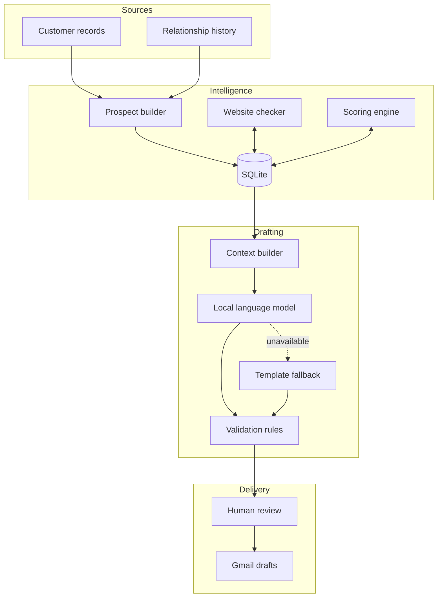

# Architecture

## Components

### Prospect builder

Matches customer profiles with relationship records, applies eligibility rules
and maintains a reviewable prospect store without discarding existing workflow
state during rebuilds.

### Scoring engine

Combines deterministic relationship, operating-pressure and automation-
opportunity signals. It stores the result and supporting rationale so the
interface can explain the recommendation.

### Website checker

Records whether a supplied business website appears reachable. This supports
qualification and prevents outreach from relying blindly on stale URLs.

### Drafting engine

Builds constrained context for a local model, parses the result and applies
content validation. A deterministic template maintains workflow continuity when
model output is unavailable or unsuitable.

### Gmail adapter

Creates individual or bounded-batch drafts using compose permissions. Delivery
ends at draft creation; no automatic-send operation is part of the workflow.

